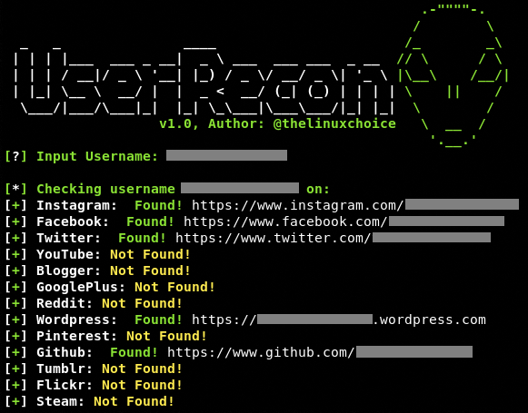

# UserRecon v2.0
# Original Author: @thelinuxchoice
# Updated by: @Erzambayu
# Further updated: 2025
# https://github.com/Erzambayu/userrecon
# https://github.com/thelinuxchoice/userrecon

Find usernames across over 30 modern social networks (2025)
This is useful if you are running an investigation to determine the usage of the same username on different social networks.



## Features

- Modern social media platform support (30+ platforms)
- Improved detection methods to reduce false positives
- Better error handling and timeout management
- Clean and organized code structure
- Results saved to text file for easy reference

## Supported Platforms

- Instagram 
- TikTok 
- Twitter/X 
- Facebook 
- LinkedIn 
- GitHub 
- YouTube 
- Reddit 
- Pinterest 
- Twitch 
- Medium 
- Tumblr 
- Snapchat 
- Telegram 
- Threads 
- Discord 
- Mastodon 
- Substack 
- Patreon 
- OnlyFans 
- Spotify 
- SoundCloud 
- Behance 
- Dribbble 
- Roblox 
- Steam 
- Fiverr 
- Etsy 
- Ko-fi 
- Buy Me a Coffee 
- DeviantArt 
- Flickr 
- Quora 
- Bluesky 

## Installation 

```bash
$ sudo apt update && apt upgrade

$ git clone https://github.com/Erzambayu/userrecon.git

$ cd userrecon

$ chmod +x userrecon.sh

$ ./userrecon.sh
```

### Compatibility

This tool has been tested in:
- Termux (Android)
- Kali Linux
- Parrot OS
- Ubuntu
- Other Debian-based distributions

All of them work perfectly fine!

## Changelog

### v2.0 (2025)
- Added 15+ new modern social platforms
- Fixed detection methods for Instagram, Facebook, Twitter/X, TikTok, and more
- Improved error handling and timeout management
- Reorganized code structure for better maintainability
- Updated user agent to modern browser
- Added internet connection checking

### v1.2
- Fixed Roblox check
- Renamed Github to GitHub
- Various bug fixes

## TODO:
- [ ] Add more regional social networks
- [ ] Implement multi-threading for faster checks
- [ ] Add option to export results in different formats (JSON, CSV)
- [ ] Create a simple GUI interface
- [ ] Add proxy support for enhanced privacy
